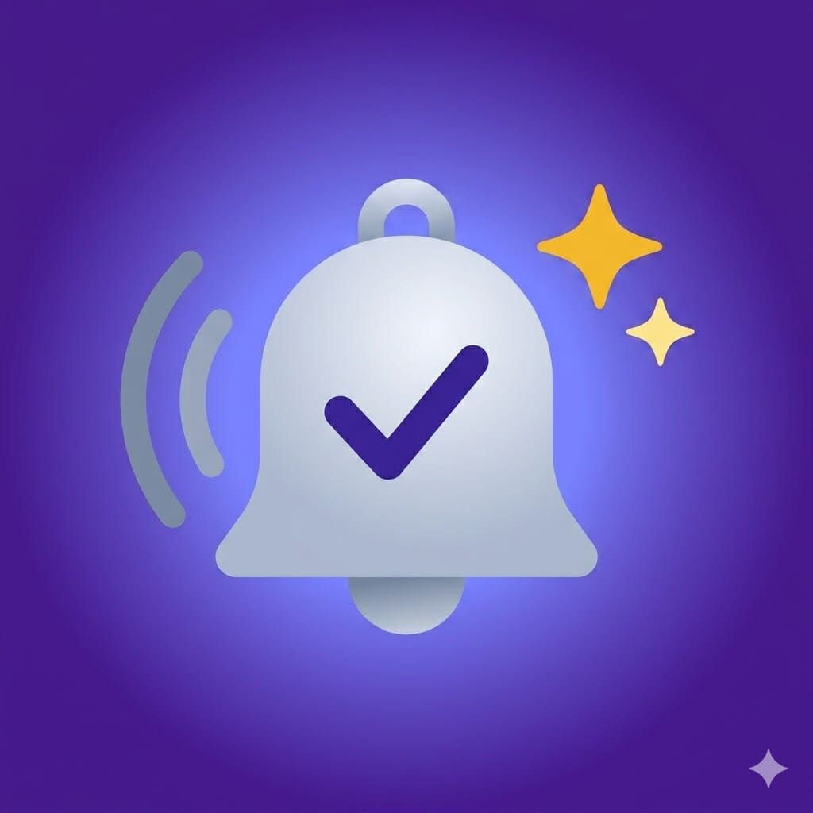
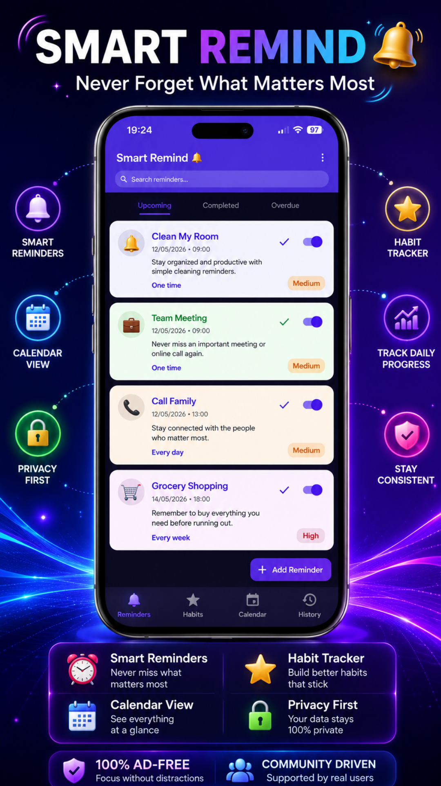
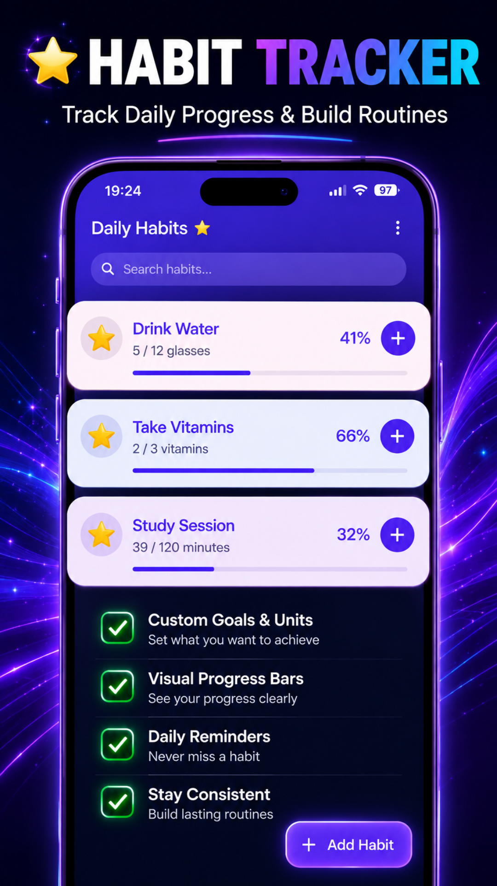
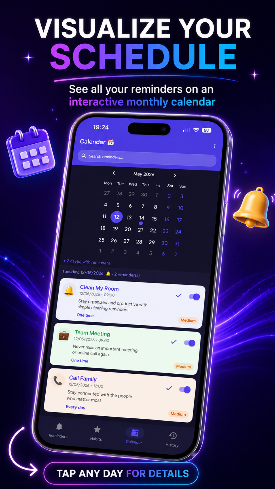
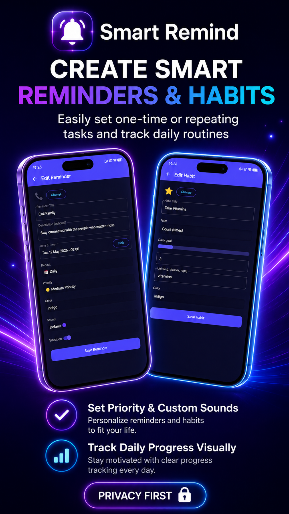
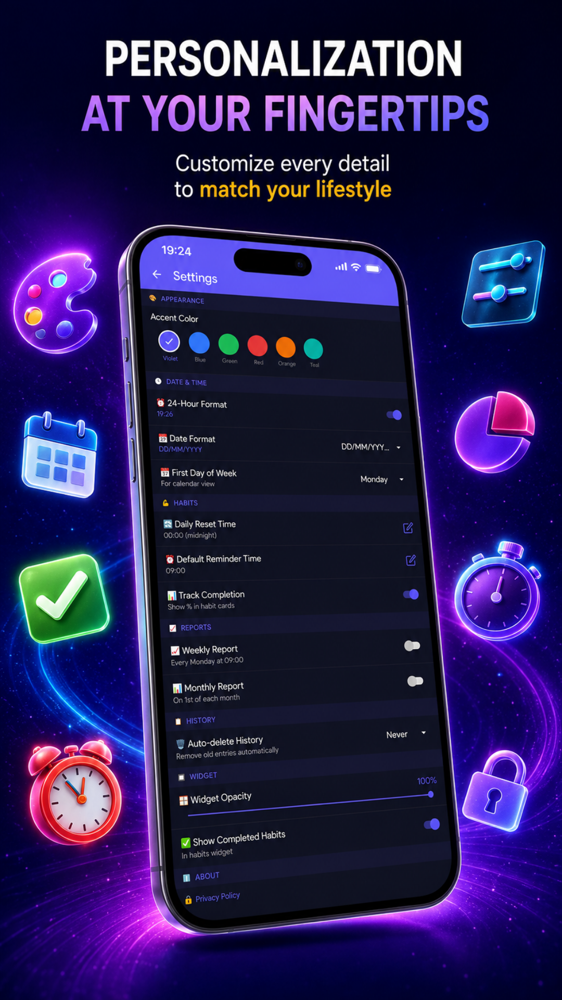
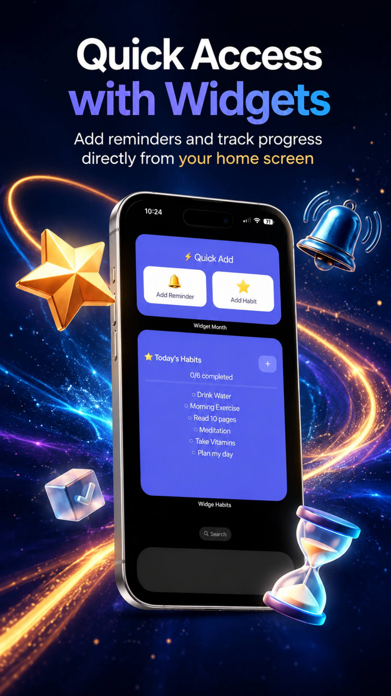

# 🔔 SmartRemind — Reminder & Habit Tracker

### Private reminders and habit tracking that stay on your device.

## Screenshots

---

## About

SmartRemind is a privacy-focused reminder and habit tracker with flexible recurrence, per-reminder sounds and priorities, calendar views, local trigger history, progress tracking and home-screen widgets.

## Features

- One-time and repeating reminders
- Daily, weekly, weekday, weekend, monthly, custom-day and interval schedules
- Per-reminder emoji, sound, priority and vibration
- Snooze and complete actions from notifications
- Count, yes/no and duration habits
- Calendar view, search and trigger history
- Weekly and monthly habit summaries
- Habit and Smart Add widgets
- No account, advertising, analytics or cloud server

## Optional Purchases

| Product | Type | Main benefit |
|---|---|---|
| Remove Prompts | One-time | Removes optional developer-support prompts. The app contains no third-party advertising. |
| Monthly Supporter | Subscription | Supporter badge and eligible custom app icons while active. |
| Premium Monthly | Subscription | Unlimited reminders and habits plus custom sounds, colors and priorities. |
| Premium Lifetime | One-time | All advertised Premium features permanently, plus eligible supporter benefits. |

Prices, currencies, trial eligibility and current benefits are shown by Google Play before purchase. Subscriptions renew until cancelled through Google Play.

## Privacy

- No third-party advertising SDKs
- No behavioral advertising or advertising profiling
- No app account required for core use
- App content stays local whenever possible
- Google Play and RevenueCat process only the purchase information needed for optional products

Read the complete [Privacy Policy](./PRIVACY_POLICY.md).

## Download

**Google Play:** [https://play.google.com/store/apps/details?id=com.smartreminddc.app](https://play.google.com/store/apps/details?id=com.smartreminddc.app)

## Documentation

| Document | Purpose |
|---|---|
| [Privacy Policy](./PRIVACY_POLICY.md) | Information handling and user rights |
| [Terms of Use](./TERMS_OF_SERVICE.md) | Rules, billing and app-specific limitations |
| [License](./LICENSE) | Proprietary software licence |
| [Security Policy](./SECURITY.md) | Responsible vulnerability reporting |
| [Support](./SUPPORT.md) | Help and troubleshooting |
| [Changelog](./CHANGELOG.md) | Notable app changes |
| [Contributing](./CONTRIBUTING.md) | Bug reports and feature suggestions |

## Developer

**Denis Casian** — Independent developer, Romania

- Website: [deniscasian.com](https://deniscasian.com/)
- Support: [support@deniscasian.com](mailto:support@deniscasian.com)
- Bug reports: [bugs.deniscasian.com](https://bugs.deniscasian.com/)

---

[SmartRemind on Google Play](https://play.google.com/store/apps/details?id=com.smartreminddc.app) · [Privacy](./PRIVACY_POLICY.md) · [Terms](./TERMS_OF_SERVICE.md)

*© 2026 SmartRemind. All rights reserved.*

