

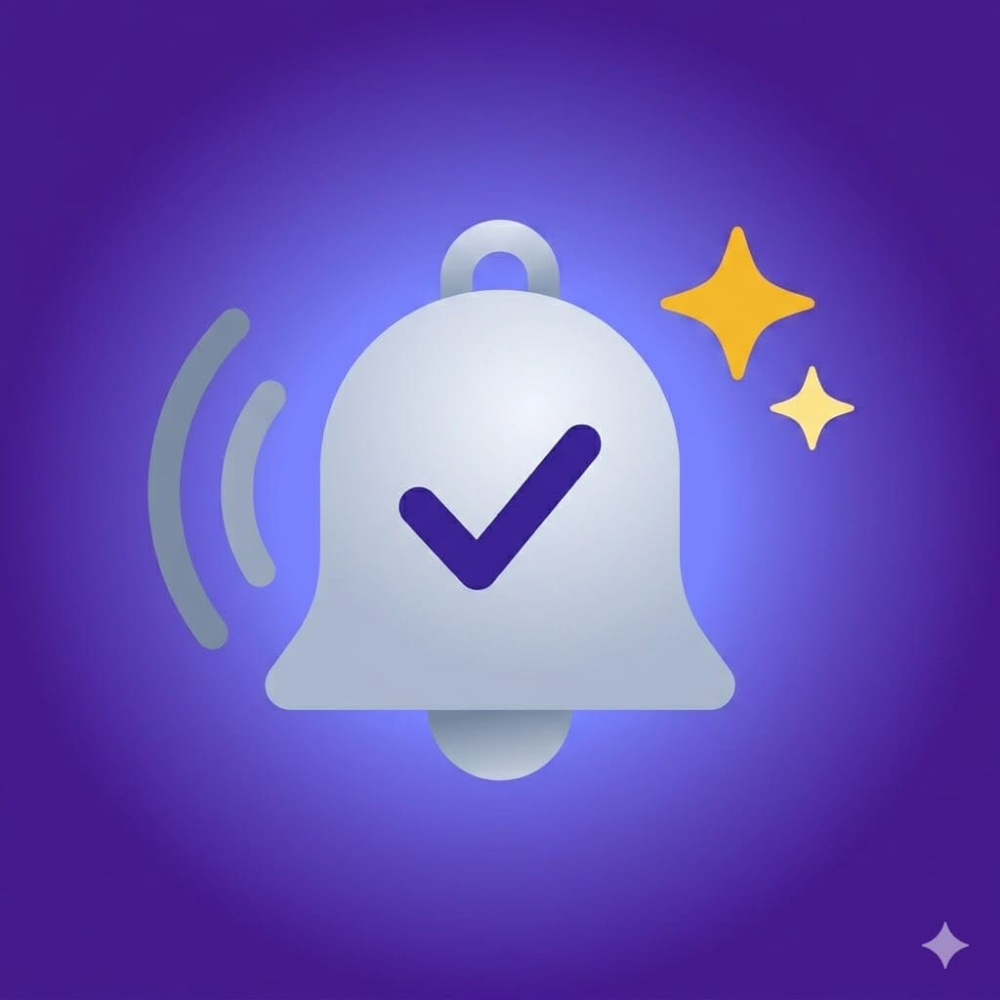

# 🔔 SmartRemind

### Reminders, Habits, Calendar & Widgets

**Never forget what matters — and build the habits that move you forward.**  
Clean. Focused. Free with optional ad-removal and Premium purchases.

---
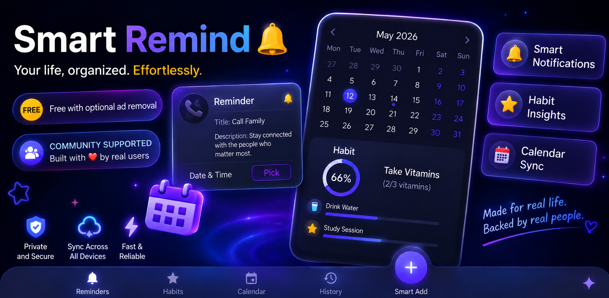

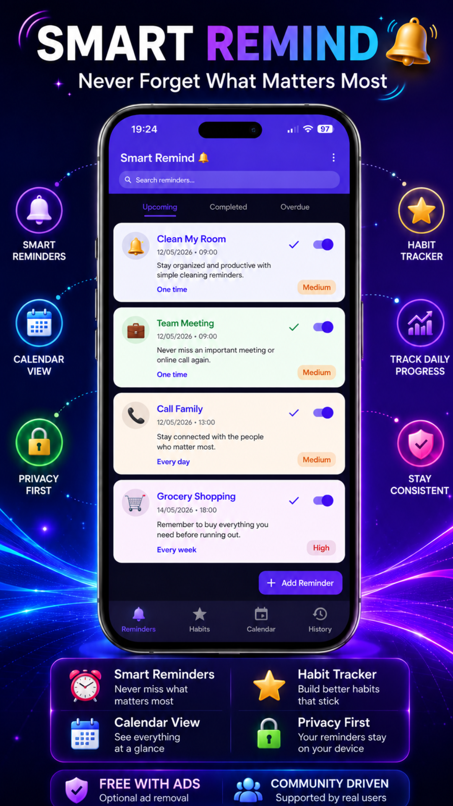
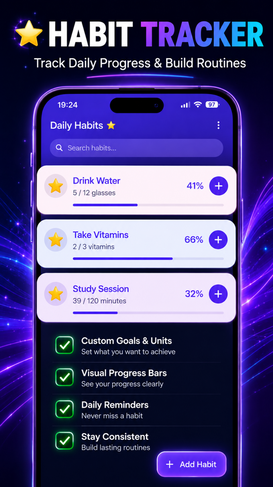
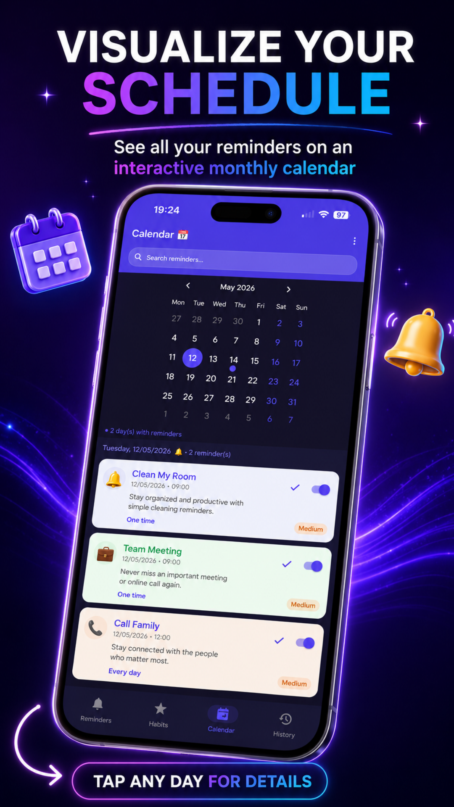
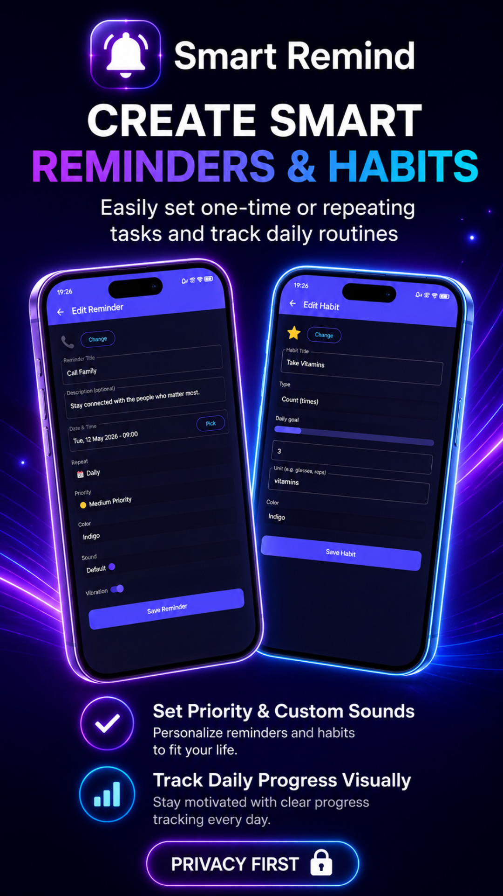
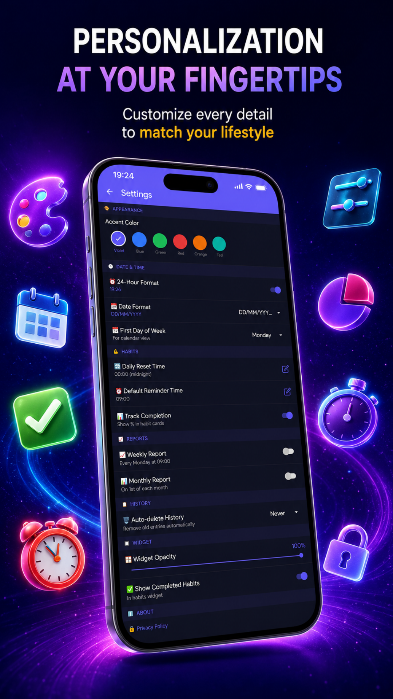
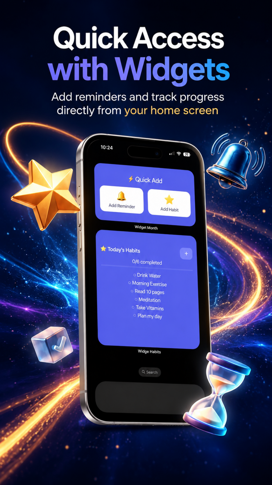

---

## 🔔 About SmartRemind

**SmartRemind** is an Android reminder and habit-tracking application.
Create flexible schedules, build daily habits, review your calendar and
history, and add items from your home screen — all in a focused interface.

Your reminder titles, descriptions, habits, progress and history are stored
**locally on your device**. No cloud account is required.

> ### 🔔 Free App — Supported by Advertising
> SmartRemind is free and supported by **Google AdMob** advertising.  
> **Remove Ads / Supporter** is the one-time ad-removal purchase.  
> **Monthly Supporter** removes all ads while the subscription is active.  
> **Premium Monthly and Premium Lifetime still include ads.**

---

## ✨ Features

### 🔔 Flexible Reminders

- One-time and repeating reminders
- Daily, weekly, weekdays, weekends and monthly schedules
- Custom days and interval-based schedules
- Upcoming, completed and overdue views
- Search your reminders instantly
- Snooze for 10 or 15 minutes or mark complete from a notification

### ⭐ Daily Habits

- Count goals, yes/no habits and timed-duration goals
- Daily progress tracking
- Configurable daily reset time
- Calendar and history views
- Optional weekly and monthly habit reports with Premium

### 📱 Home Screen Widgets

| Widget | Description |
|---|---|
| **Quick Add** | Add a reminder or habit directly from your home screen |
| **Daily Habits** | See today's habit progress and open your habit list |

Widgets support resizing, accent colors, transparency and display preferences.
Preview support is included for older Android launchers and modern tablets.

### ⏰ Reliability-Focused Notifications

- Android exact-alarm scheduling where permission allows
- WorkManager backup for additional resilience
- Periodic alarm rescheduling
- Alarm restoration after device restart
- Notification sounds, vibration and priority controls

> Notification delivery depends on Android permissions, battery settings,
> manufacturer restrictions and device state. Exact delivery is not guaranteed.

### 🎨 Personal Settings

- Light, dark and system theme options
- Six accent color themes
- Clock and date formats
- First day of the week
- History retention preferences
- Widget transparency and completed-habit display options

---

## 👑 Premium Features

| Feature | Free | Premium |
|---|:---:|:---:|
| Flexible reminders and daily habits | ✅ | ✅ |
| Calendar, history and home screen widgets | ✅ | ✅ |
| Reminders and habits | Up to 5 each | Unlimited |
| **Custom notification sounds** | ❌ | ✅ |
| **Individual reminder and habit colors** | ❌ | ✅ |
| **Priority controls and custom emoji** | ❌ | ✅ |
| **Weekly and monthly habit reports** | ❌ | ✅ |
| **Eligible badges and custom app icons** | ❌ | ✅ |
| **Removes Google AdMob advertising** | ❌ | ❌ |

> Ad removal is a separate benefit of **Remove Ads / Supporter** or an active
> **Monthly Supporter** subscription. Premium Lifetime grants Premium access;
> it does not mark the other products as purchased.

---

## 💳 Pricing

SmartRemind is **free** and supported by Google AdMob advertising.  
All paid tiers are optional. Current prices, local currency and any offers
are shown in the app and Google Play before purchase.

### One-Time Purchases

| Product | Price | Description |
|---|:---:|---|
| 💎 **Premium Lifetime** | Shown in Google Play | All Premium features permanently. **Ads are still shown** unless you also have ad-removal access. |
| ❤️ **Remove Ads / Supporter** | Shown in Google Play | Removes banner, native, interstitial and app-open ads with a valid one-time entitlement. Does not unlock Premium features. |

### Subscriptions

| Product | ID | Price | Benefits |
|---|---|:---:|---|
| 👑 **Premium Monthly** | `premium_monthly` | Shown in Google Play | Unlimited reminders and habits · custom sounds, colors, priorities and emoji · reports. **Ads are still shown.** |
| ❤️ **Monthly Supporter** | `supporter_monthly` | Shown in Google Play | **Removes all advertising while active** · Supporter badge · eligible custom app icons |

> ❤️ Ad-removal purchases help keep SmartRemind free and actively developed.
> Ads can return after a refunded or revoked ad-removal purchase, or after
> Monthly Supporter expires. Cancelling renewal keeps access until the current
> paid subscription period ends. Thank you to everyone who contributes.

---

## 🛡️ Privacy

SmartRemind keeps your **reminder and habit content on your device:**

| | |
|---|---|
| 🔔 | Google AdMob adaptive banners, native, interstitial and app-open ads |
| ✅ | All ad formats removed with an eligible ad-removal entitlement |
| ✅ | Google UMP checks privacy requirements before ad requests |
| ✅ | Applicable choices can be revisited in Settings → Ad Privacy Choices |
| ✅ | Reminder and habit content is not supplied to advertising providers |
| ℹ️ | AdMob may process device identifiers, IP-based approximate location, interactions and diagnostics |
| ✅ | Purchases managed by Google Play and RevenueCat |
| ✅ | Reminders, habits, history and preferences stored locally |
| ✅ | No cloud account required for reminders and habits |

Ad personalization and eligible ad formats depend on your choices and
applicable requirements. The ad-privacy entry is hidden when ads are disabled.

→ **[Full Privacy Policy](./PRIVACY_POLICY.md)**

---

## 🔗 Download

**[SmartRemind on Google Play](https://play.google.com/store/apps/details?id=com.smartreminddc.app)**

---

## 📸 Tablet

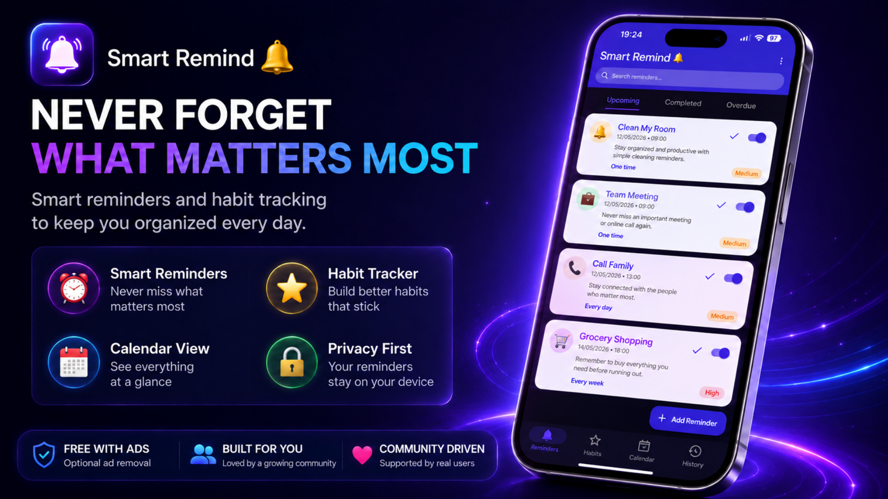
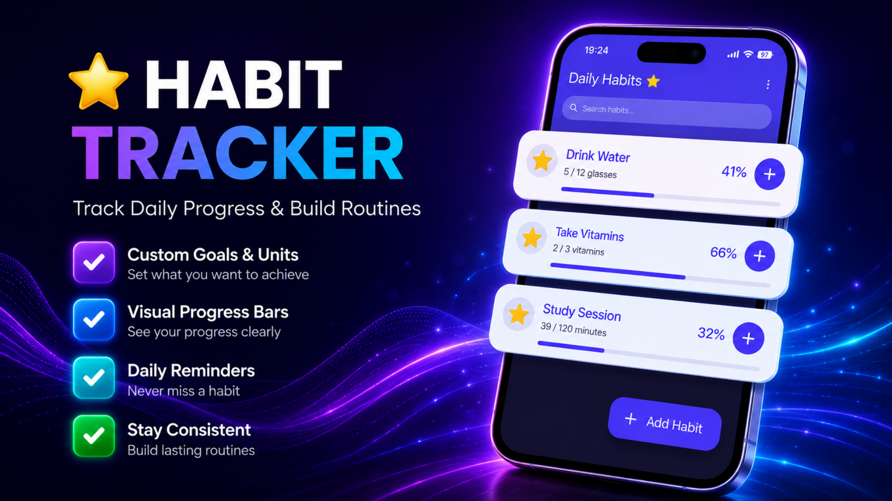
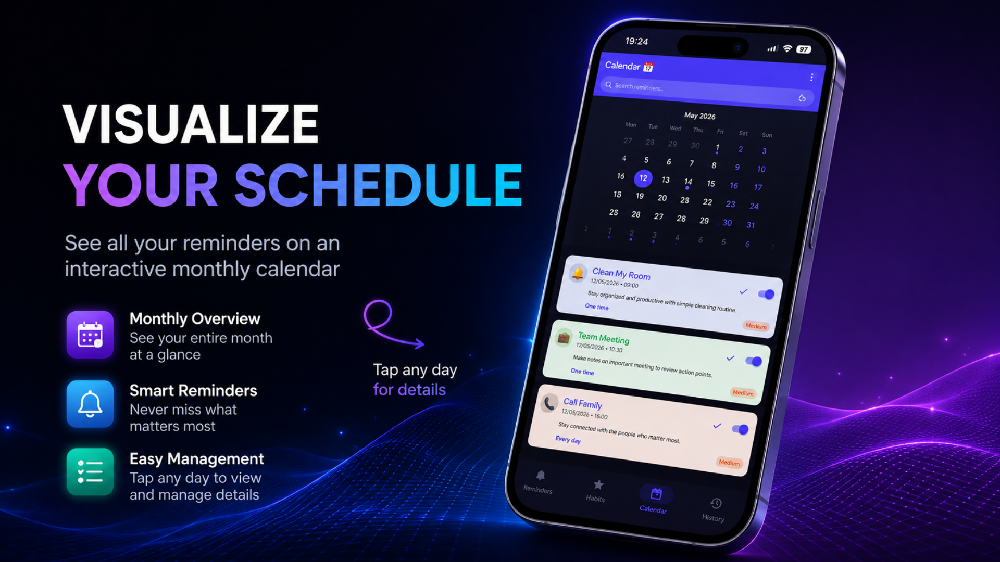
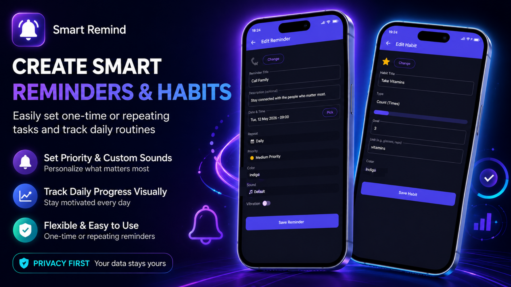
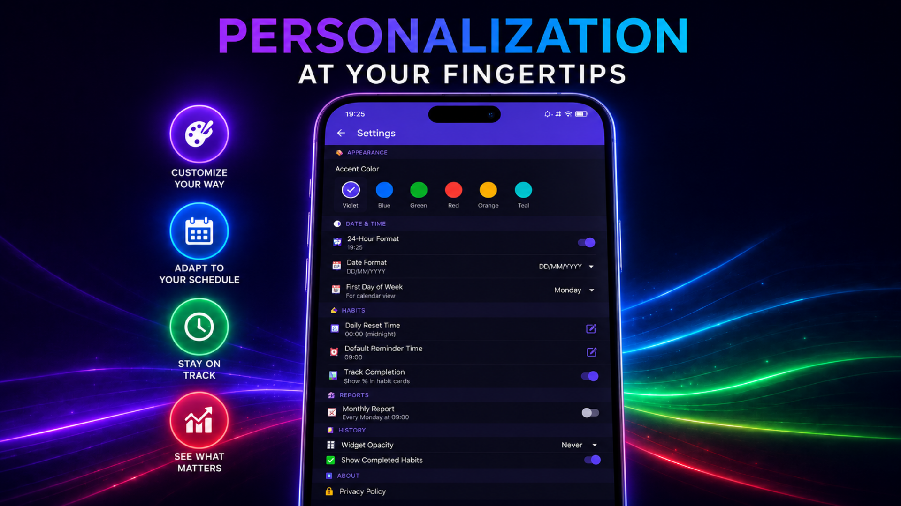

---

## 📄 Legal Documents

| Document | Description |
|---|---|
| [Privacy Policy](./PRIVACY_POLICY.md) | Local content, advertising data and privacy choices |
| [Terms of Use](./TERMS_OF_SERVICE.md) | Rules for using SmartRemind and purchase benefits |
| [License](./LICENSE) | Proprietary software license |
| [Security Policy](./SECURITY.md) | How to report vulnerabilities |
| [Changelog](./CHANGELOG.md) | Version history |
| [Support](./SUPPORT.md) | Help and contact information |

---

## 👤 Developer

**Denis Casian** — Independent developer, Romania 🇷🇴

| | |
|---|---|
| 🌐 Website | [rdcapps.com](https://rdcapps.com) |
| 📧 Support | [support@rdcapps.com](mailto:support@rdcapps.com) |
| 🐛 Bug Reports | [bugs.rdcapps.com](https://bugs.rdcapps.com) |
| 📱 App | [SmartRemind on Google Play](https://play.google.com/store/apps/details?id=com.smartreminddc.app) |

---

Made with ❤️ for your reminders and daily habits.

**[Download SmartRemind](https://play.google.com/store/apps/details?id=com.smartreminddc.app)** ·
**[Privacy Policy](./PRIVACY_POLICY.md)** ·
**[Terms of Use](./TERMS_OF_SERVICE.md)**

*© 2026 SmartRemind. All rights reserved.*

